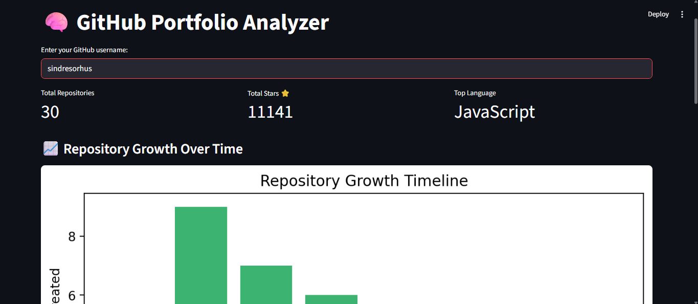

# 🧠 GitHub Portfolio Analyzer

This is a Streamlit app that analyzes a GitHub user's repositories and generates insights, charts, and downloadable reports about their portfolio.

## 🚀 Features
- Fetches repositories of a given GitHub username.
- Displays:
  - Total repositories
  - Total stars
  - Top programming language
  - Repository growth over time (bar chart)
  - Repository health (archived/stale/license info)
- Download reports as:
  - CSV (all data)
  - PDF summary (top stats & projects)

## 📷 Screenshot


## 📋 Installation & Run

### Clone the repo:
```bash
git clone https://github.com/abhay-kowshik/github-portfolio-analyzer.git
cd github-portfolio-analyzer
